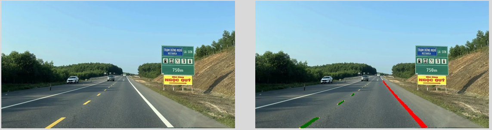
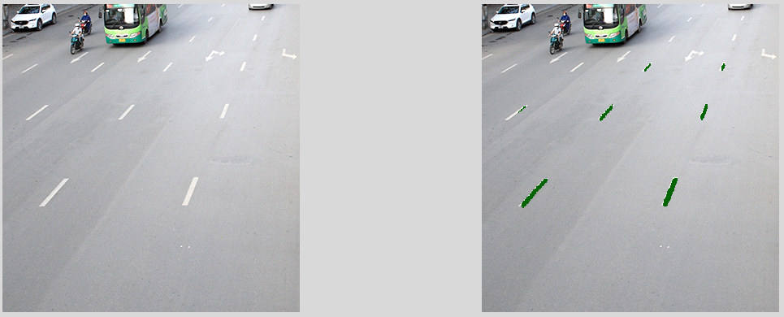
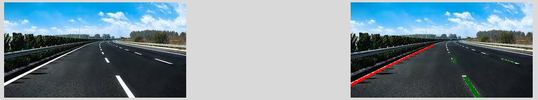

# 🚀 Lane Segmentation: Nhận diện làn đường cơ bản
## 🌟 Mô Tả

Project này triển khai một hệ thống **phân đoạn làn đường (lane segmentation)** cơ bản. Mục tiêu là nhận diện và phân biệt chính xác các đường kẻ làn xe (liền và đứt quãng) trong hình ảnh, làm nền tảng cho các ứng dụng hỗ trợ lái xe và xe tự hành.

---

## 📁 Dữ liệu

### Nguồn dữ liệu
Dữ liệu được sử dụng cho dự án này được lấy từ [Roboflow Universe](https://universe.roboflow.com/tobias-price-lane-detection-solid-and-dashed/lane-detection-segmentation-edyqp/dataset/7). 

### Xử lý dữ liệu và tạo mask
Sau khi tải dữ liệu về, chúng ta cần giải mã file **COCO JSON** để tạo ra hai loại mask riêng biệt:

1.  **Mask cho tập huấn luyện (Train Masks):** Dùng để huấn luyện mô hình.
2.  **Mask cho tập kiểm tra/đánh giá (Validation Masks):** Dùng để đánh giá hiệu suất của mô hình.

Quá trình này thường bao gồm việc chuyển đổi các polygon trong JSON thành các ảnh mask nhị phân, lưu trữ chúng trong các thư mục riêng biệt (`dataset/train_mask` và `dataset/valid_mask`) c.

---

## 🧠 Dataset & Model

### Dataset
Dataset được xây dựng để cung cấp các cặp **hình ảnh đầu vào** và **mask tương ứng** cho quá trình huấn luyện và đánh giá mô hình. Các bước tiền xử lý như thay đổi kích thước, chuẩn hóa giá trị pixel, và tăng cường dữ liệu (data augmentation) được áp dụng để cải thiện khả năng học của mô hình và giảm thiểu overfitting.

### Model
Dự án này sử dụng kiến trúc **U-Net** cho nhiệm vụ phân đoạn, được triển khai thông qua thư viện `segmentation_models_pytorch`. U-Net là một mạng nơ-ron tích chập (CNN) phổ biến trong các bài toán phân đoạn ảnh, nổi bật với khả năng bắt giữ cả ngữ cảnh toàn cục và chi tiết cục bộ nhờ kiến trúc đối xứng.

Cấu trúc U-Net bao gồm:
* **Encoder (Path xuống):** Thu nhỏ hình ảnh đầu vào, trích xuất các đặc trưng ngữ nghĩa.
* **Decoder (Path lên):** Mở rộng các đặc trưng đã học, khôi phục lại độ phân giải không gian để tạo ra mask phân đoạn ở độ phân giải gốc.
* **Skip connections:** Kết nối trực tiếp giữa encoder và decoder ở các cấp độ tương ứng, giúp truyền tải thông tin chi tiết bị mất trong quá trình mã hóa.

**Chi tiết triển khai mô hình:**
Sử dụng một phiên bản U-Net với các cấu hình sau:
* **Encoder (Backbone):** Được chọn là **`resnet34`**. Đây là một kiến trúc ResNet phổ biến, cung cấp sự cân bằng tốt giữa tốc độ xử lý và khả năng trích xuất đặc trưng mạnh mẽ, phù hợp cho các tác vụ thị giác máy tính.
* **Trọng số Encoder:** Sử dụng trọng số đã được huấn luyện trước trên bộ dữ liệu **ImageNet**. Việc sử dụng các trọng số này (gọi là **pre-trained weights**) giúp mô hình khởi đầu với khả năng nhận diện các đặc trưng cơ bản của hình ảnh, từ đó tăng tốc độ hội tụ trong quá trình huấn luyện và cải thiện đáng kể hiệu suất phân đoạn.
* **Kênh đầu vào (`in_channels`):** Là `3`, tương ứng với ảnh đầu vào có 3 kênh màu (RGB).
* **Số lớp đầu ra (`classes`):** Là `3`, đại diện cho các lớp mà mô hình cần phân đoạn:
    * **Lớp 0:** Nền (background)
    * **Lớp 1:** Vạch liền (solid lane lines)
    * **Lớp 2:** Vạch đứt (dashed lane lines)
* **Hàm kích hoạt cuối cùng (`activation`):** Được để là `None`. Điều này phù hợp khi sử dụng hàm mất mát **`CrossEntropyLoss`** trong PyTorch, vì nó đã tích hợp sẵn hàm softmax hoặc sigmoid cần thiết.

---

## ✅ Test Model

Dưới đây là hình ảnh minh họa về kết quả phân đoạn làn đường sau khi mô hình được huấn luyện và kiểm thử sau 25 epoch. Mask dự đoán được chồng lên ảnh gốc để dễ dàng quan sát.

### Kết quả mẫu 1

### Kết quả mẫu 2

### Kết quả mẫu 3

---
